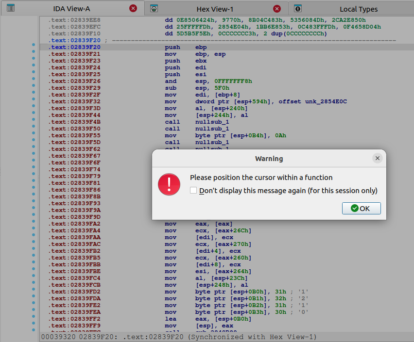
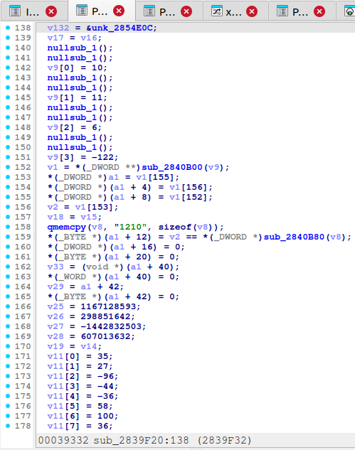
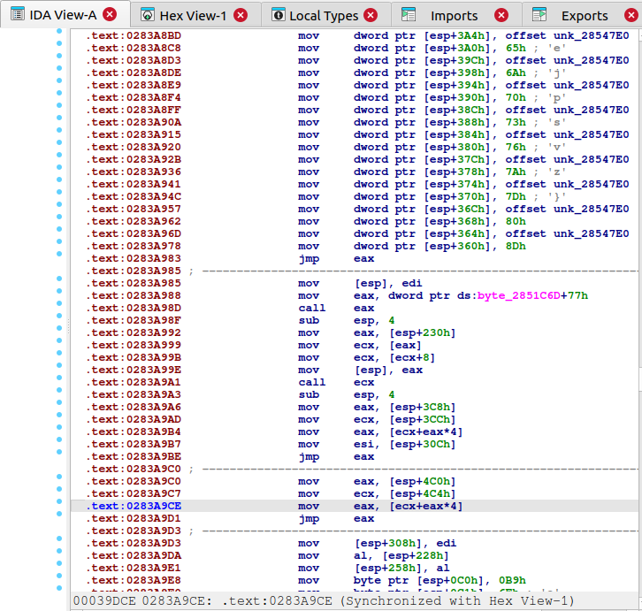
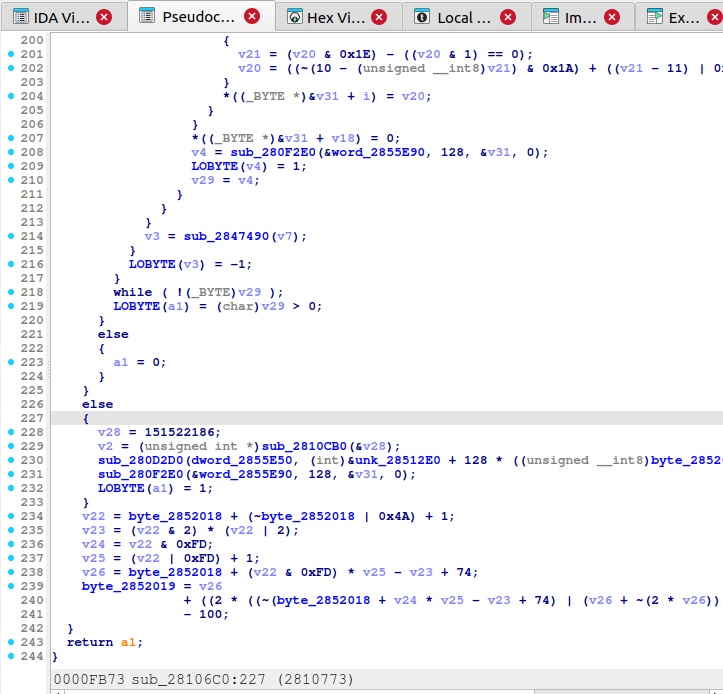
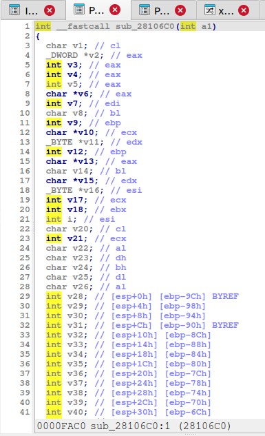
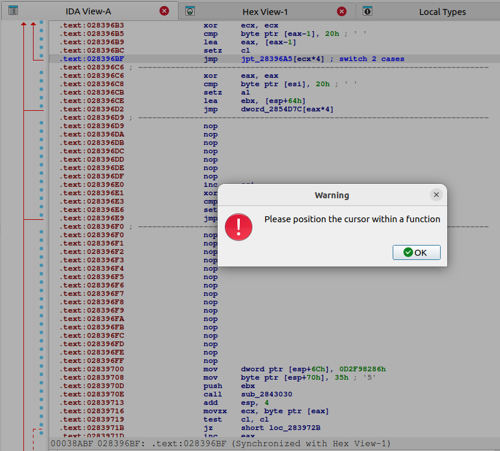
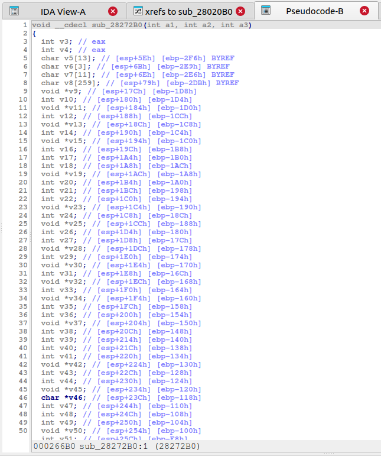
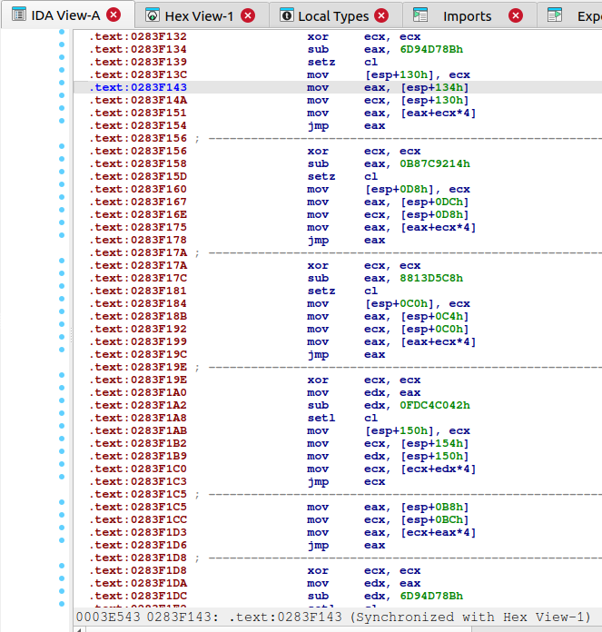
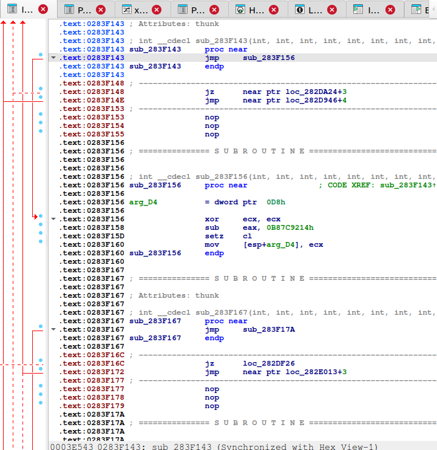
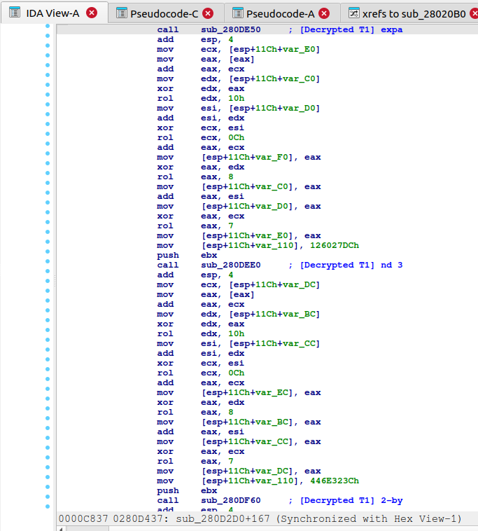

# Lumma Stealer Deobfuscator

IDA Pro Python scripts for deobfuscating [Lumma Stealer](https://malpedia.caad.fkie.fraunhofer.de/details/win.lumma) (a.k.a. LummaC2), an information-stealing malware.

## Target Sample

We unpacked the Lumma Stealer sample from a Go-based loader, then deobfuscated the unpacked Lumma Stealer payload.

| Property | Value |
|----------|-------|
| SHA-256 |  `de67d471f63e0d2667fb1bd6381ad60465f79a1b8a7ba77f05d8532400178874` |
| Malware | Go-based Loader |
| Build Date | Unknown (timestamp stripped) |
| Architecture | x86_64 |


| Property | Value |
|----------|-------|
| SHA-256 |  `37fc0dc17d6168506a7584654495b5a77d915981e9a0fda2e17f8b219c4415eb`|
| Malware | Lumma Stealer (LummaC2) |
| Build Date | Jan 14 2026 |
| Architecture | x86 |

The loader sample is available on [MalwareBazaar](https://bazaar.abuse.ch/sample/de67d471f63e0d2667fb1bd6381ad60465f79a1b8a7ba77f05d8532400178874/). The payload PE can be extracted from the loader using memory dump during RunPE injection (WriteProcessMemory).

> **Note**: Standalone scripts (`capstone_scan_obfuscation.py`, `unicorn_resolve_cff.py`) require the payload binary. Adjust the `PAYLOAD_PATH` variable to point to your local copy.

## Before / After

### Decompilation: Failure → Success (CFF)

CFF (Control Flow Flattening) replaces conditional branches with table-based indirect jumps (`mov eax,[eax+ecx*4]; jmp eax`), preventing Hex-Rays from building a function graph.

| Before | After |
|--------|-------|
|  |  |
| Hex-Rays refuses to decompile (`0x02839F20`) | Same address: 288 lines of COM/WMI initialization code |

The root cause — a CFF dispatcher at `0x0283A9CE`:



### Decompilation: Opaque → Readable (String Decryption)

MBA-obfuscated decrypt functions and encrypted stack data make functions unreadable even when decompilation succeeds.

| Before | After |
|--------|-------|
|  |  |
| Magic constants and MBA expressions | IDA comments show decrypted strings (URLs, paths, GUIDs) |

### Disassembly: Indirect Jump Resolution (FF 25)

Indirect jumps (`jmp [dword_XXXXXXXX]`) break disassembly — bytes after the jump are misidentified as data.

| Before | After |
|--------|-------|
|  |  |
| `jmp` followed by raw data bytes (`dw`, `dd`) | Indirect jump patched to direct `E9`, code flow restored |

### Disassembly: CFF Dispatcher → Conditional Branch

CFF dispatchers are replaced with `jcc`/`jmp` pairs, restoring the original branch structure.

| Before | After |
|--------|-------|
|  |  |
| `mov eax,[eax+ecx*4]; jmp eax` (table dispatch) | `jz`/`jmp` conditional branch + NOP (dispatcher removed) |

### String Decryption Result

Decrypted strings are annotated as IDA comments, revealing malware functionality at a glance.



---

## Deobfuscation Results

### String & Data Deobfuscation

**610 call sites** processed across **460 unique decrypt functions**, with a **100% success rate** (0 extraction failures, 0 decryption failures).

| Type | Count | Description |
|------|------:|-------------|
| UTF-16LE strings | 128 | Wide strings (Windows API arguments, URLs, paths, commands) |
| UTF-8 strings | 73 | Narrow strings (HTML parsing patterns, HTTP headers, keywords) |
| GUID | 8 | COM interface / CLSID identifiers |
| Shellcode | 3 | Executable code blobs (x64 syscall stubs, Heaven's Gate) |
| DWORD | 271 | 4-byte constants (port numbers, status codes, API hashes, timeouts) |
| Other binary | 125 | Raw binary data (encryption keys, small code fragments) |
| Layer 2 encoded | 1 | Double-encrypted string requiring second-pass decoding |
| UTF-16BE | 1 | Rare big-endian string variant |
| **Total** | **610** | |

11 distinct decryption algorithms (MBA-obfuscated XOR/ADD operations) were identified and implemented.

### Code Deobfuscation

| Technique | Count | Tool |
|-----------|------:|------|
| Indirect jumps (FF 25 → E9) | 288 | `lumma_fix_code_obfuscation.py` |
| CFF dispatchers (contiguous) | 399 | `lumma_fix_cff_v2.py` (also in `obfuscation_scan_results.json`) |
| CFF dispatchers (split) | 68 | `lumma_fix_cff_v2.py` (IDA-only detection) |
| Zeroed switch tables | 7 | `fix_zeroed_switches.py` |
| jmp/call reg code recovery | 12 | `lumma_code_deobfuscator.py` (Phase A) |
| Dead code removal | 1170 | `lumma_code_deobfuscator.py` (Phase D) |
| Junk instruction pairs | 16 | `lumma_code_deobfuscator.py` (Phase C, opt-in) |

### Representative Decrypted Samples

#### Strings (UTF-16LE / UTF-8)

```
0x0280FC35: "Mozilla/5.0 (Windows NT 10.0; Win64; x64) AppleWebKit/537.36 ..."
0x0281090C: "https://steamcommunity.com/profiles/76561199880317058"
0x028122CB: "cmd.exe \"start /min cmd.exe \"/c timeout /t 3 /nobreak & del \""
0x0281808A: "powershell -exec bypass"
0x0281CE27: "\REGISTRY\MACHINE\SOFTWARE\Microsoft\Windows\CurrentVersion\Uninstall\"
0x0280ECDB: "<div class=\"tgme_page_title\" dir=\"auto\">\n  <span dir=\"auto\">"
0x0280CCC7: "Content-Disposition: form-data; name=\""
```

#### GUIDs

```
0x0282A448: {00021401-0000-0000-C000-000000000046}  (CLSID_ShellLink)
0x0282A48C: {000214F9-0000-0000-C000-000000000046}  (IShellLinkA)
0x0282A4D0: {0000010B-0000-0000-C000-000000000046}  (IPersistFile)
0x02844341: {4590F811-1D3A-11D0-891F-00AA004B2E24}  (IWbemObjectSink)
0x02844391: {DC12A687-737F-11CF-884D-00AA004B2E24}  (IClassFactory2)
```

## Scripts

### IDA Pro Scripts (run in order)

| # | Script | Description |
|---|--------|-------------|
| 1 | `lumma_fix_code_obfuscation.py` | Patches `jmp [dword_XXXXXXXX]` indirect jumps (FF 25 → E9 direct). Restores IDA code flow analysis across ~288 sites. |
| 2 | `lumma_fix_cff_v2.py` | Patches CFF (Control Flow Flattening) dispatchers. Handles both contiguous (`mov reg,[reg+reg*4]; jmp reg`) and split patterns. ~467 dispatchers across 4 clusters. |
| 3 | `fix_zeroed_switches.py` | Fixes 7 zeroed switch tables that cause "switch analysis failed" in Hex-Rays. Patches each to jump to default case. |
| 4 | `lumma_code_deobfuscator.py` | Multi-phase cleanup: (A) jmp/call reg code recovery, (B) data-to-code in CFF regions, (C) junk instruction removal, (D) dead code elimination. |
| 5 | `lumma_deobfuscator.py` | Main string/data deobfuscator. Identifies 460 decrypt functions, extracts encrypted stack data, decrypts with 11 MBA algorithm types, annotates IDA comments. |
| 6 | `lumma_apply_layer2.py` | Writes Layer 2 decoded results back to IDA comments. |

### Standalone Scripts

| Script | Description |
|--------|-------------|
| `lumma_decrypt.py` | **Standalone string/data decryptor using Unicorn emulation.** No IDA required. Detects decrypt functions automatically and recovers encrypted data by emulating each function directly. See [Standalone Decryptor](#standalone-decryptor-lumma_decryptpy) below. |
| `lumma_layer2_decoder.py` | Applies second-layer decoding to double-encrypted entries. |
| `capstone_scan_obfuscation.py` | Offline Capstone-based scanner that detects obfuscation patterns without IDA. |

## Usage

### Recommended execution order in IDA Pro

```
1. lumma_fix_code_obfuscation.py   # Fix indirect jumps (FF 25 → E9)
2. lumma_fix_cff_v2.py             # Fix CFF dispatchers (NOP sequences)
3. fix_zeroed_switches.py          # Fix zeroed switch tables
4. lumma_code_deobfuscator.py      # Cleanup: jmp reg, dead code (default phases="ABD"; Phase C is opt-in)
5. lumma_deobfuscator.py           # Decrypt strings and data
6. lumma_layer2_decoder.py         # (standalone) Decode Layer 2 entries
7. lumma_apply_layer2.py           # Apply Layer 2 to IDA comments
```

Each script is run via **File > Script file** in IDA Pro (except standalone scripts which run with Python 3).

All scripts provide `revert_*()` functions to undo patches. Note that `revert_all_patches()` in script 4 reverts ALL byte patches from all scripts.

## CFF Obfuscation Analysis

The binary uses a CFF variant where each conditional branch is replaced by a table-based dispatch:

```
[setcc reg]                       ; compute branch condition (0/1)
mov [esp+INDEX_OFF], reg          ; store as index
mov REG_A, [esp+TABLE_OFF]       ; load jump table pointer
mov REG_B, [esp+INDEX_OFF]       ; load index
mov REG_A, [REG_A+REG_B*4]      ; dereference table[index]
jmp REG_A                        ; dispatch
```

Each dispatcher has its own table/index pair on the stack (not a shared state variable). 85 dispatchers use constant indices (always jump to the same target), 126 use `setcc`-based indices (obfuscated conditional branches), and ~250 use computed indices.

The fix strategy NOPs the entire setup+dispatch sequence (avg 21.4 bytes per dispatcher), allowing code to fall through. This is viable because 98% of dispatchers have valid code immediately after them.

## Results

The `results/` directory contains analysis outputs in JSON format:

| File | Description |
|------|-------------|
| `deobf_results.json` | All 610 decrypted strings, binary data, GUIDs, DWORDs, and shellcode with addresses, algorithm types, and decrypted values. |
| `obfuscation_scan_results.json` | Capstone offline scan results: 399 contiguous CFF dispatchers, 288 indirect jumps, 16 junk pairs, 1198 MBA clusters, and anti-disassembly patterns. Split dispatchers (68) are detected by the IDA script only. |
| `cff_cluster3_resolved.json` | Resolved CFF dispatcher targets for Cluster 3 (181/228 dispatchers, with jump table entries and setcc types). |
| `cff_cluster2_resolved.json` | Resolved CFF dispatcher targets for Cluster 2 (63/94 dispatchers). |

## Standalone Decryptor (`lumma_decrypt.py`)

An IDA-free string/data decryptor that uses Unicorn CPU emulation instead of manual MBA algorithm classification.

### How it works

1. **Prologue scan**: Finds decrypt function candidates by scanning `.text` for known prologue byte patterns (`sub esp, 0x14` etc.)
2. **Emulation-based verification**: Each candidate is called via Unicorn with a test buffer. Functions that modify the buffer in-place are confirmed as decrypt functions. This treats each function as a black box, eliminating the need to reverse-engineer 11 MBA algorithm variants.
3. **Call site discovery**: Scans for `E8 rel32` (CALL) instructions targeting verified decrypt functions.
4. **Stack byte extraction**: Extracts encrypted data from `mov [esp+N], imm` / `mov [reg+N], imm` patterns before each call site.
5. **Emulated decryption**: Feeds the extracted encrypted bytes into the decrypt function via Unicorn and captures the plaintext output.

```bash
pip install pefile capstone unicorn
python3 lumma_decrypt.py payload.exe -o results.json -v
```

### Comparison with IDA Python approach

| | IDA Python (`lumma_deobfuscator.py`) | Standalone (`lumma_decrypt.py`) |
|---|---|---|
| Decrypt functions detected | 460 (59 manually specified) | **577 (fully automatic)** |
| Call sites processed | 610 | **790** |
| Decrypted successfully | 610 (100%) | **781 (98.9%)** |
| Matched against IDA results | — | **606/610 (99.3%)** |
| Extract failures | 0 | 9 |
| IDA Pro required | Yes | **No** |
| Algorithm classification | 11 types manually reverse-engineered | **Not needed (black-box emulation)** |
| Manual parameters | 59 functions + 3 hardcoded results | **None** |
| Code size | ~3,700 lines | **~600 lines** |

### Why 4 entries cannot be recovered (static analysis limitation)

The standalone tool misses 4 entries from the IDA version (all small binary data, no strings):

| Call site | Size | IDA result | Root cause |
|-----------|------|------------|------------|
| `0x0281651E` | 2B | `0x007A` | Encrypted byte loaded via register from a prior computation (`movzx` from memory), not an immediate constant |
| `0x02820B1F` | 3B | `0x48BE00` | Data assembled across `mov word [esp+0x128], imm16` + `mov byte [esp+0x12a], imm8` with a large stack frame offset; the IDA version uses frame analysis to resolve `var_XX` symbolic names |
| `0x028229B3` | 4B | `0x0000002A` | Encrypted DWORD written to `[esp+0x16]` (non-aligned, unusual offset) amid unrelated word/byte writes to adjacent offsets that pollute the extraction window |
| `0x0283E589` | 4B | `0x00000064` | Encrypted DWORD placed by `mov dword ptr [esp+0x190], imm32` at a deep stack offset (0x190); the call passes a pointer via `mov eax, esp` but without an explicit `lea`/`push` pattern |

All 4 cases involve **non-standard stack data construction** where:
- The encrypted bytes are not placed with a simple `mov [esp/reg+small_disp], imm` pattern, or
- The buffer pointer is passed through an indirect register chain without an identifiable `lea`/`push` sequence.

The IDA Python version handles these via IDA's frame variable tracking (`var_XX` resolution) and operand type analysis, which are unavailable in a standalone context. These 4 entries are all small binary constants (WORD/DWORD), not strings or GUIDs, so the practical impact is negligible.

### Why 9 call sites fail extraction entirely

These are calls to heavily-reused decrypt functions (e.g., `0x02849700` called 42 times) where the encrypted data is constructed through:
- Multi-step register computation (e.g., `mov eax, [mem]; push eax` where the value comes from a prior load)
- Conditional paths that write different data depending on runtime state
- Nested function calls that return the encrypted buffer pointer

Static byte-pattern scanning cannot resolve these without data-flow analysis or emulation of the calling code.

## Known Limitations

These scripts are research tools validated against the target sample (SHA256 `de67d471...`) only.

- **Sample-specific byte scanning**: `lumma_fix_cff_v2.py` and `lumma_fix_code_obfuscation.py` use raw byte pattern scanning (not instruction-boundary-aware) to locate dispatcher setup sequences. False matches on other binaries could cause incorrect patches. Both scripts include a target sample guard that checks the original .text hash and warns if the binary doesn't match.
- **Phase C EFLAGS side-effect**: `lumma_code_deobfuscator.py` Phase C removes instruction pairs that cancel in value (add/sub, xor/xor, inc/dec) but these instructions modify EFLAGS. A subsequent `jcc`, `setcc`, or `cmov` depending on those flags could change semantics. Phase C is excluded from the default execution (`phases="ABD"`) and must be explicitly opted in with `phases="ABCD"`.
- **Switch register matching**: `fix_zeroed_switches.py` searches for a `mov reg, [mem]` within 5 instructions before a `jmp reg` switch without verifying register consistency. In practice, all 7 zeroed switches in this sample were already resolved by IDA auto-analysis, so this code path was never exercised.

## Future Work

- **MBA expression simplification**: 1198 MBA expression clusters were detected by the Capstone scanner (346 of which are non-loop, likely obfuscation rather than legitimate crypto/hash). These produce correct but complex pseudocode in Hex-Rays. A simplification pass could reduce `((x & m) | (~x & ~m)) + k` back to `x ^ m + k`.
- **Generalize for Lumma variants**: Auto-detect algorithm parameters, section layout, and version-specific patterns for other builds.
- **Layer 2 low-confidence entries**: 8 decoded entries with confidence < 0.60 need IDA runtime verification.
- **Cross-cluster CFF flow tracing**: Enumerate all inter-cluster jumps and trace register values to resolve remaining Cluster 0/1 dispatchers. See `CFF_CROSS_CLUSTER_ANALYSIS.md` for details.
